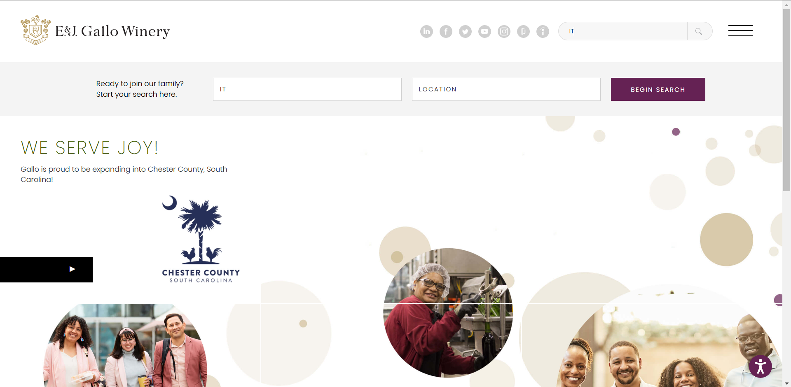
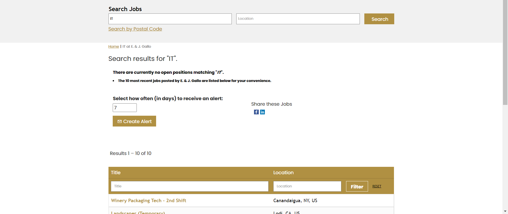
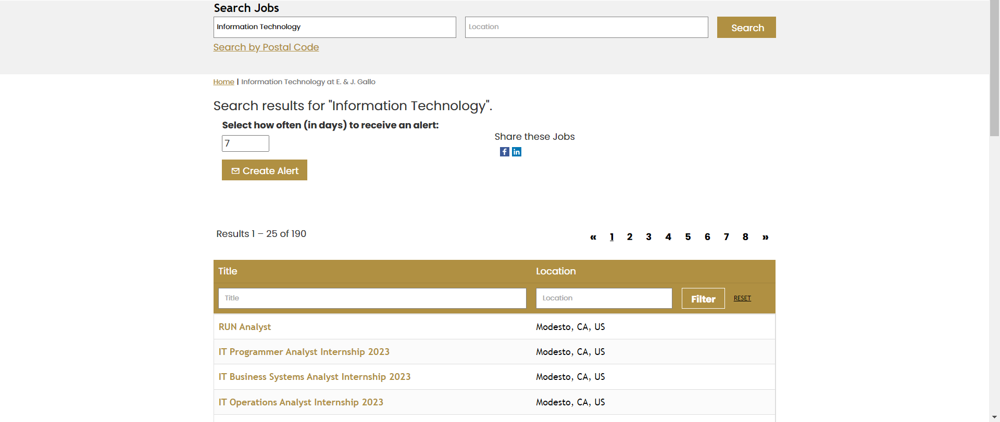
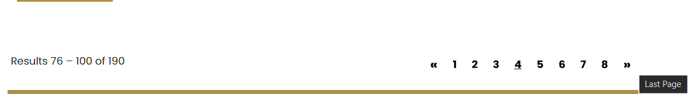

# Analysis of User Experience of E&J Gallo career website
## By Jose Sanchez 10/14/2022

[//]: # (A narrative that describes your user experience with technology. It should include your goals, a description of the interaction, and the outcome.)  
[//]: # (You should assess the user experience in terms of concepts taught in class and/or the most relevant UX goals: effective, efficient, safe, satisfying, learnable, memorable, useful, error tolerant.) 

After visiting the job fair and talking to the recruiters for E&J Gallo, they suggested I apply to their website so they can match my resume to my application on their website. After accessing their career website, I was greeted with a nice looking home page with a search bar in the middle. The search fields are "Keyword" and "Location" which are standard for a career website(Consistency and Standards Heuristic). Since I want to see all available "IT" positions, I'm going to just type "IT" for my keyword and click search.

After finishing the search, I get this as a result

This says there are no open positions for "IT". Interesting, what happens if I search for "Information Technology"?

Now we see that we get results. Seems like the keyword search isn't considering job's with the word "IT" but rather than some backend tag or other method. This can be remedied by including job results that have "IT" in them. This makes the website **efficient** because I now only have to type a partial match of a job result rather than going through every single page of job results and/or figuring out what is the correct keyword for the jobs I want to search.

Another interesting experience I had with the website when trying to apply for a job was changing pages. E&J Gallo's website includes clickable page numbers and arrows on the side. I usually don't expect page numbers to be clickable so I first try to use the right arrow button. But, after I clicked the right arrow button, it took me to the last page. If I hover over the arrow, it even says it'll take me to the last page. The left arrow takes me to the first page. This is again an issue with standards since websites, on average, use the arrows to jump 1 page, not multiple. This can be fixed by just adding 1 to the current page for the next page.

