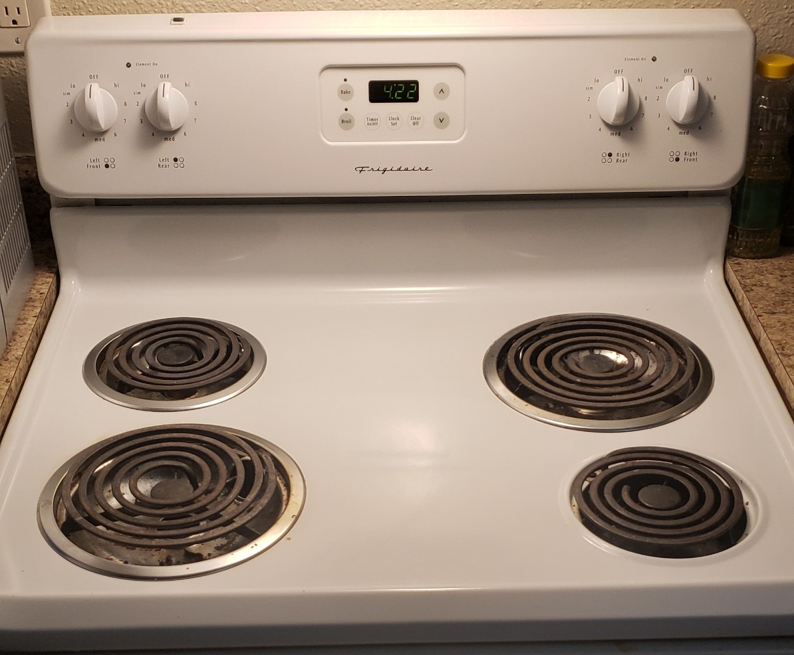
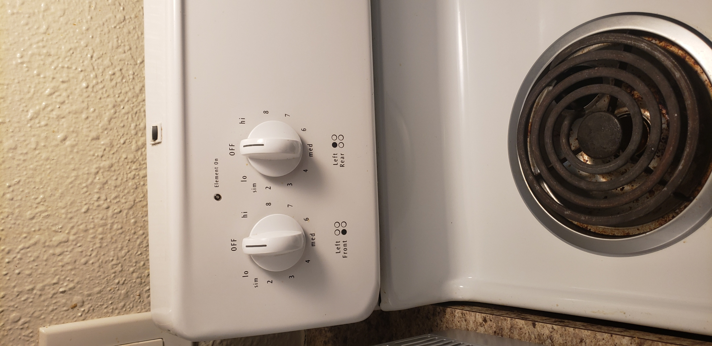
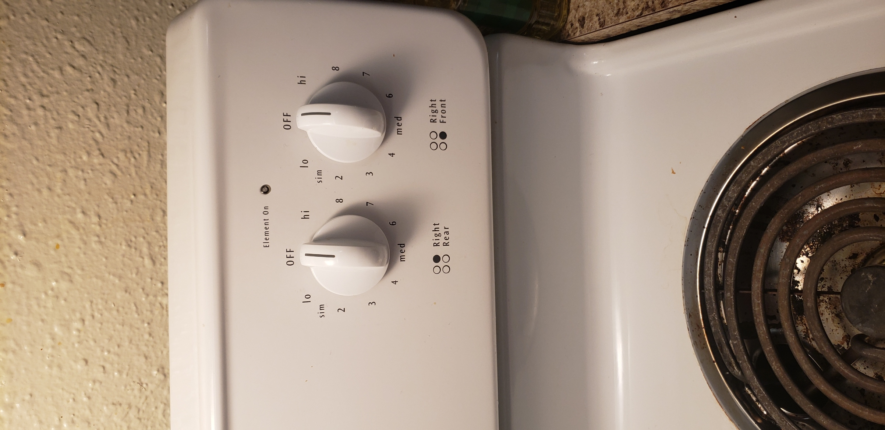

# Analysis of User Experience of Stove
## By Jose Sanchez 12/15/2022

After using my stove for 4 months, I have had some annoying little mistakes with it. I initially didn't pay too much attention to what burner valve corresponded to what burner since I mainly used the left side and was completely fine with that. Once I started using the whole stove, I would occasionally turn on the opposite burner than what I entended to. Here is what my stove looks like.

It is the typical 4 burner stove with two large burners slanted from each other and two other smaller burners. This was fine until I looked closer at what each burner valve corresponded to. 

On the left side, we see the left valve corresponds to the front burner and the back burner corresponds to the right valve. Everything is fine here

Once we look at the right side, the left valve corresponds to the back burner and the right corresponds to the front.

I would expect the valves to be identical, not mirrored. When turning on a valve on one side, you expect turning on the valve on the other side to turn on the same burner but on the other side. Instead, it turns on the opposite one. It looks more this is because the burners are mirrored on the stovetop.

When I make dinner and have to use the slanted big burners, I first turn on the right valve on each side or the left valve on each side. I always ends up waiting around 5-10 minutes before I realize I turned on the wrong burner. Also, maybe if there was some better indication on the stovetop which burners were on, this can help with making the stove more **error tolerant**. 
